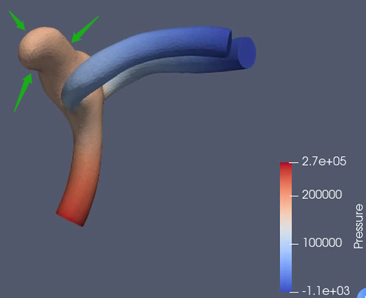

The result is:



The left picture shows the geometry. The yellow color indicates wall, the red color indicates inlet, and blue color indicates the outlet.

The right picture shows the `SU2` result. The right picture is shown by python code:

```python

import vtkmodules.all as vtk

reader = vtk.vtkXMLUnstructuredGridReader()
reader.SetFileName('flow.vtu')
reader.Update()

flow = reader.GetOutput()

mapper = vtk.vtkDataSetMapper()
mapper.SetInputData(flow)

mapper.SetScalarModeToUsePointFieldData()
mapper.ScalarVisibilityOn()
mapper.SelectColorArray('Pressure')
mapper.Modified()

actor = vtk.vtkActor()
actor.SetMapper(mapper)
actor.GetProperty().SetOpacity(0.3)

renderer = vtk.vtkRenderer()
renderer.AddActor(actor)
renderer.SetBackground(1, 1, 1)
renWin = vtk.vtkRenderWindow()
renWin.AddRenderer(renderer)
iren = vtk.vtkRenderWindowInteractor()
iren.SetInteractorStyle(vtk.vtkInteractorStyleTrackballCamera())
iren.SetRenderWindow(renWin)
iren.Initialize()
iren.Start()

```

